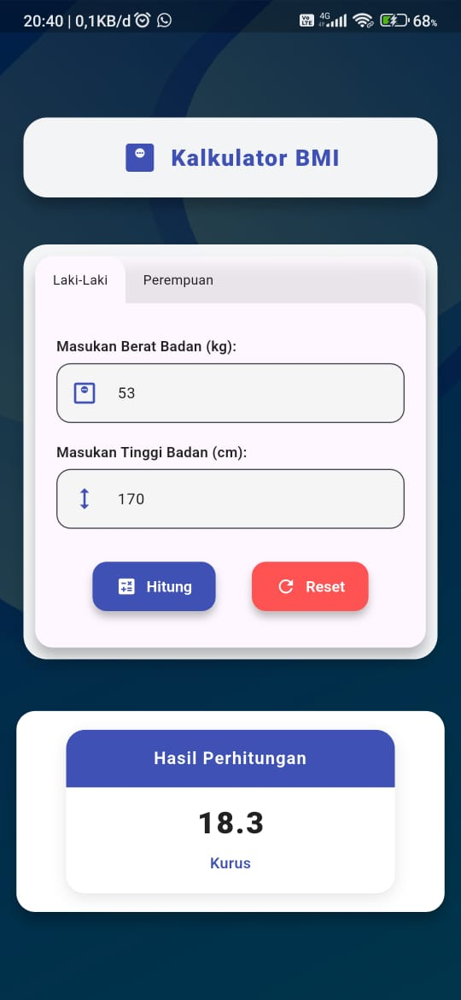
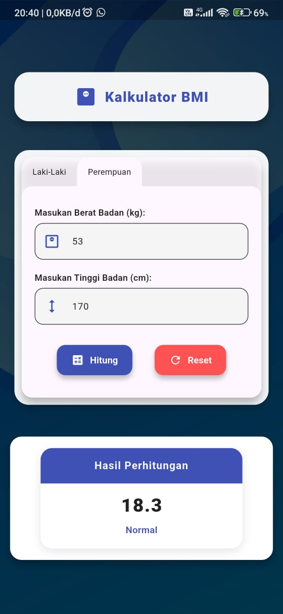

# 🧮 BMI Calculator (Body Mass Index)

A simple and interactive **BMI (Body Mass Index)** calculator built with Flutter.  
This app helps users calculate their BMI and determine their body classification (Underweight, Normal, Overweight, etc.) based on gender and physical data.

---

## 📸 Demo Preview

### 📱 Application Interface

### 🧔 BMI for Men

### 👩 BMI for Women

---

## 🧠 About the Project

This project demonstrates:
- Simple BMI calculation logic
- Gender-based BMI classification
- Clean UI design with responsive layout
- Flutter state management best practices

---

## ⚙️ Formula Used

BMI = kg/m^2

**Classification:**
| Category | Male BMI Range | Female BMI Range |
|-----------|----------------|------------------|
| Underweight | < 20.0 | < 18.0 |
| Normal | 20.0 – 25.0 | 18.0 – 23.0 |
| Overweight | > 23.0 - 30.0 | > 23.0 - 27.0 |
| obesity | > 30.0 | > 27.0 |
---
